# 💰 PayrollHelper

<p align="center">
  <a href="https://dotnet.microsoft.com/"></a>
  <a href="https://docs.microsoft.com/en-us/dotnet/csharp/"></a>
  <a href="https://www.postgresql.org/"></a>
  <a href="https://docs.microsoft.com/en-us/ef/core/"></a>
  <a href="https://github.com/dotnet/winforms"></a>
  <a href="LICENSE"></a>
</p>

> Бухгалтерское приложение для управления сотрудниками, выплатами и налогами.

---

## 📋 Оглавление
- [🚀 Возможности](#features)
- [🛠️ Технологии и требования](#tech)
- [⚙️ Установка](#install)
- [🗄️ Настройка базы данных](#db-setup)
- [🏃 Запуск приложения](#run)
- [👥 Пользователи по умолчанию](#users)
- [📸 Скриншоты](#screenshots)
- [📄 Лицензия](#license)
- [⭐ Поддержка](#support)

---

<h2 id="features">🚀 Возможности</h2>

- 🔐 **Авторизация** — вход по логину/паролю с хэшированием SHA256
- 👥 **Управление сотрудниками** — добавление, просмотр, редактирование
- 💰 **Выплаты** — начисление зарплаты, премий, специальных сумм
- 📑 **Управление налогами** — добавление и настройка налогов
- 🧾 **Управление выплатами** — создание типов выплат с привязкой налогов
- 🪑 **Должности** — управление должностями и статусами (активна/неактивна)
- 🛠️ **Редактирование БД** — полный доступ к таблицам (только для админа)
- 📊 **Генерация отчётов** — выбор типа, периода, формата (.txt / .csv)
- ✅ **Валидация данных** — подсветка ошибок, защита от некорректного ввода

---

<h2 id="tech">🛠️ Технологии и требования</h2>

| Компонент | Технология / Требование | Версия |
|-----------|------------------------|--------|
| **Платформа** | .NET | 6.0 |
| **Язык** | C# | 12.0 |
| **Графический интерфейс** | WinForms | .NET 6.0 |
| **ORM** | Entity Framework Core | 6.0 |
| **База данных** | PostgreSQL | 18 |
| **Тестирование** | xUnit | 2.4.1 |
| **ОС** | Windows | 10 / 11 |

---

<h2 id="install">⚙️ Установка</h2>

### 1. Клонирование репозитория

```bash
git clone https://github.com/RamenOfficialGovPatsy/PayrollHelper.git
cd PayrollHelper
```

### 2. Установка .NET 6.0

Скачайте и установите [.NET 6.0 SDK](https://dotnet.microsoft.com/download/dotnet/6.0) (не только Runtime).

> ⚠️ **Важно:** Приложение требует .NET SDK версии 6.0. Если у вас установлена более новая версия SDK, проект всё равно будет собираться с версией 6.0 благодаря файлу `global.json` в корне репозитория.

### 3. Установка PostgreSQL 18

Скачайте и установите [PostgreSQL 18](https://www.postgresql.org/download/)

---

<h2 id="db-setup">🗄️ Настройка базы данных</h2>

### 1. Создание пользователя и базы данных

Подключитесь к PostgreSQL и выполните:

```sql
CREATE USER payroll_user WITH PASSWORD '123';
CREATE DATABASE payroll_db OWNER payroll_user ENCODING 'UTF8';
GRANT ALL PRIVILEGES ON DATABASE payroll_db TO payroll_user;
```

### 2. Создание таблиц

Выполните скрипты из папки `Docs/DatabaseScripts/` в следующем порядке:

| Файл | Описание |
|------|----------|
| `1_create_tables.sql` | Создание таблиц с ограничениями |
| `2_add_foreign_keys.sql` | Добавление внешних ключей |
| `3_insert_all_data.sql` | Заполнение начальными данными |

> 💡 **Примечание:** Скрипт `4_drop_all_tables.sql` предназначен для полного удаления всех таблиц (используется при пересоздании базы данных).

### 3. Проверка подключения

```bash
psql -U payroll_user -d payroll_db
```

---

<h2 id="run">🏃 Запуск приложения</h2>

### Через Visual Studio

1. Откройте `PayrollHelper.slnx`
2. Установите `PayrollHelper` как стартовый проект
3. Нажмите `F5` или `Ctrl+F5`

### Через командную строку

```bash
cd PayrollHelper
dotnet build -c Release
dotnet run --project PayrollHelper
```

---

<h2 id="users">👥 Пользователи по умолчанию</h2>

| Логин | Пароль | Роль |
|-------|--------|------|
| `admin` | `admin` | Администратор |
| `CEO` | `CEO123` | Администратор |
| `user` | `user` | Пользователь |

> 💡 **Примечание:** После первого запуска файл `users.json` создаётся автоматически в папке с приложением. Новых пользователей можно добавить через форму "Создать пользователя".

---

<h2 id="screenshots">📸 Скриншоты</h2>

### 1. Форма авторизации
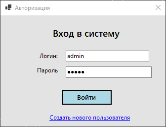

### 2. Создание пользователя
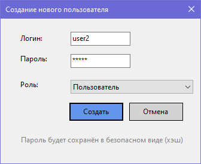

### 3. Главное меню
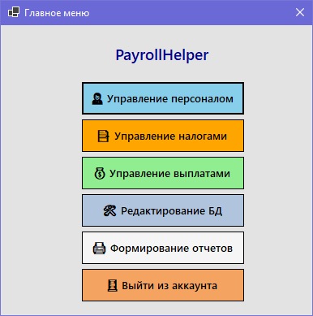

### 4. Вкладка выплат
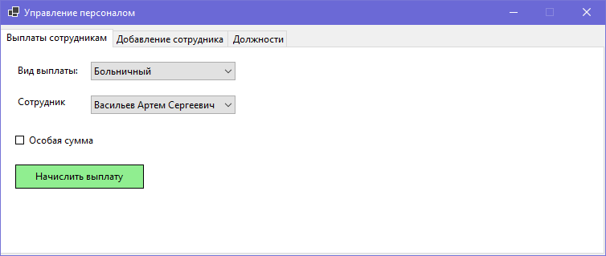

### 5. Вкладка добавления сотрудника
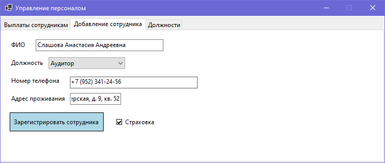

### 6. Вкладка должностей
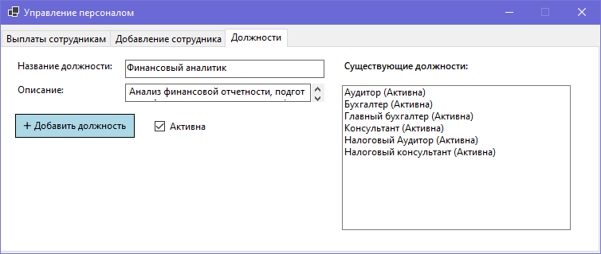

### 7. Управление налогами
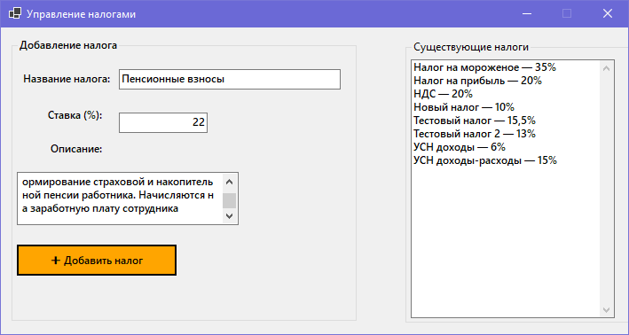

### 8. Управление типами выплат
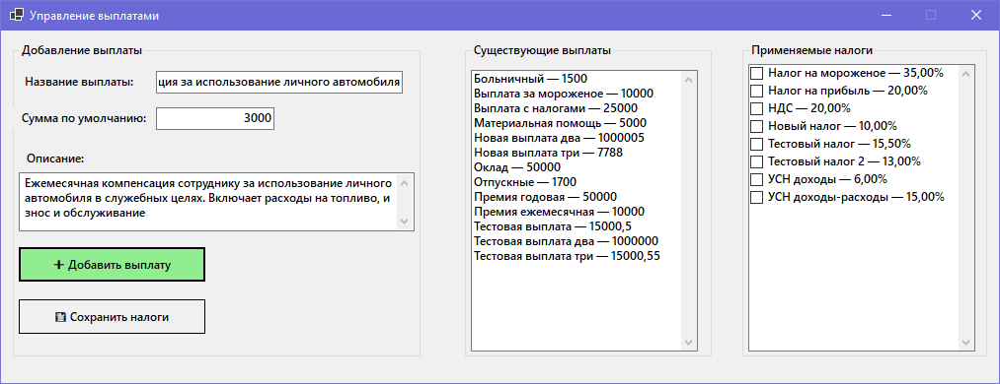

### 9. Редактирование базы данных
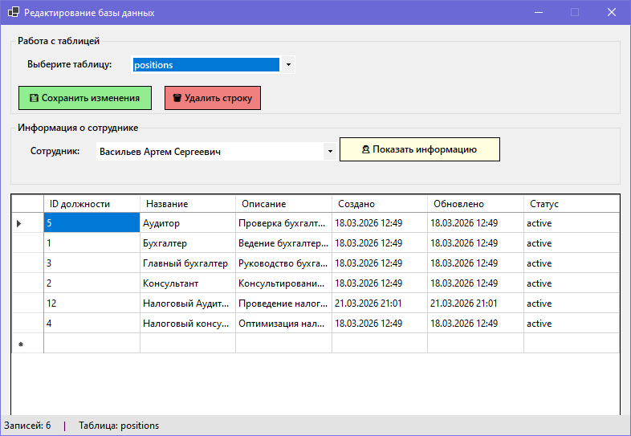

### 10. Информация о сотруднике
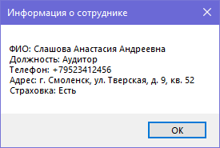

### 11. Формирование отчётов
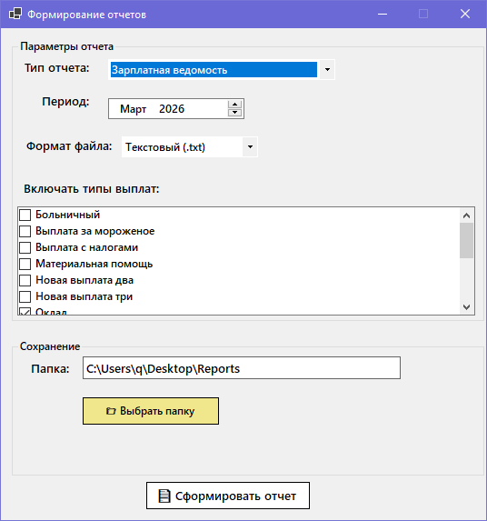

---

<h2 id="license">📄 Лицензия</h2>

Проект распространяется под лицензией MIT. Подробнее в файле [LICENSE](LICENSE).

---

<h2 id="support">⭐ Поддержка</h2>

Если проект оказался полезным, поставьте звезду — это лучший способ сказать «спасибо» и помогает проекту находить новых пользователей.